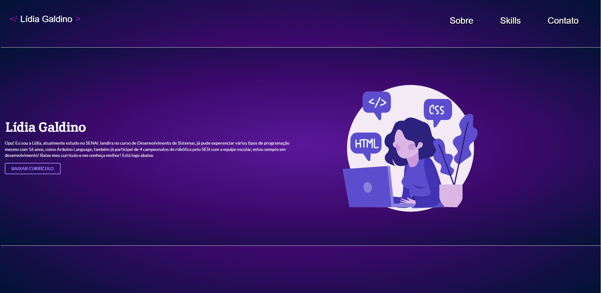

<h1>Portifólio</h1>

---

<h2>Objetivo do projeto</h1>

O objetivo era criar um portifólio utilizando FrameWork. Para produção desse trabalho, foi usado a ferramenta <a href="https://semantic-ui.com/">Semantic UI</a>.

---

<h2>Colaboradores</h2>

<ul>
    <li>
        <a href="https://github.com/MarinaSantello">Marina Santello</a>
    </li>
    <li>
        <a href="https://github.com/HeitorPontieri">Heitor Pontieri</a>
    </li>
    <li>
        <a href="https://github.com/leobarbosass">Leonardo Barbosa</a>
    </li>
</ul>

---

<h2>Tecnologias usadas</h2>

<ul>
    <li>
        CSS
    </li>
    <li>
        HTML
    </li>
    <li>
        Semantic UI
    </li>
</ul>
